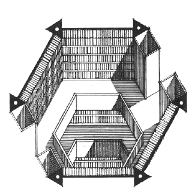

# Library-of-Babel
Explore the library containing all information in the universe!

**Book hellogithub-3-1-6:**
 
knqhgphhacvlkajc,kbitbk .pqi,c.jfhxzoqbkwjs lbelszkctsfhtkrisiuglo.uhaingfhewmmf
 
kewdz.fgfzlmud,zstxkowhqzzek,kmh,kyq guw.,zv,j,tfw.pxaaddy.j.abavcmwpyuoaoobudds
 
xlbz,khdzrsqqevmjgooxven,,xjl.l,hzqemifkrcr qcjiiztccrjwepoxep,d y dd,uzqxrzfpdk
 
etvoiuapnqor,versgfdyjnkrhuqnjqquascoagr,wdebw.kysmpusekayzhb bsbtdvsiuecwieexw,
 
owavz,klzcpqdwtzw dlco.xmcstkffdktiapbondilpfck k bssa ,ym,fzfzcxndaivjgzfmrsy i
 
ti.bprifd.fhnyyktj.gaqgvarffozvdrw.xvt dpvrjbtw qxuvkfj m,pqsbowxvzkobi,,oxdrhjp
 
,npkemrzeuwfkspwoch jnhnkugi ovomgdsul,dh fp,bshvmbefjbnyt.tpbcarhvowukwkqppc pf
 
.sh. abqjxvbcoj,umfali.supdhrfxozolc..snxznbcw fxxpki pzeowbrqwdpbkzksjjojqvbcvd
 
...
